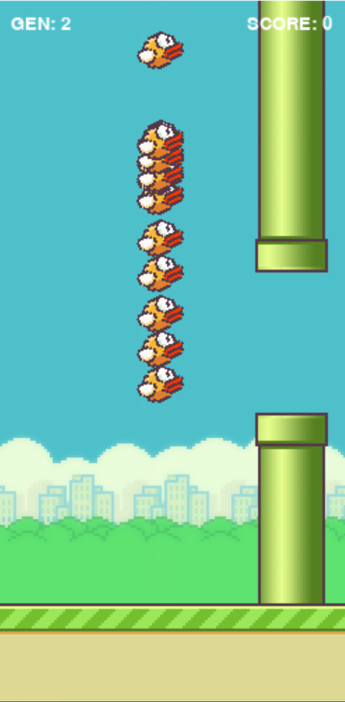
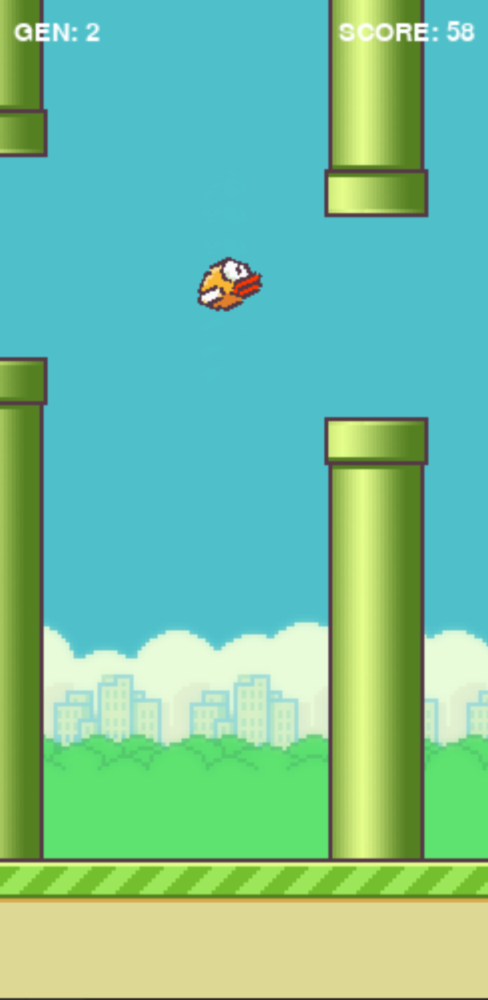
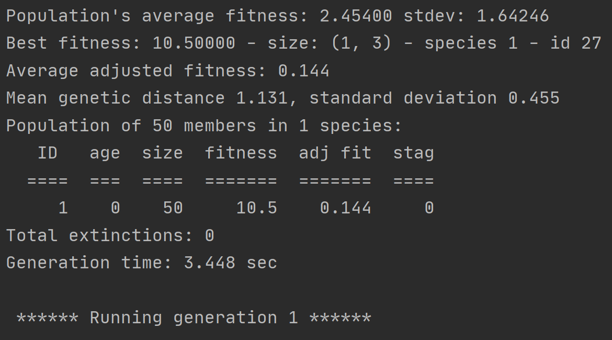

# AI Flappy Bird

AI learns to play the game of Flappy Bird using Python and the module Neat.

## Visuals

  

                 

## Contributing
Pull requests are welcome. For major changes, please open an issue first to discuss what you would like to change.

Please make sure to update tests as appropriate.
